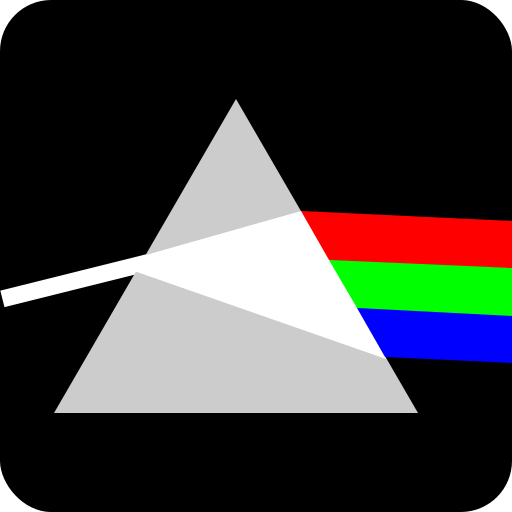

### ahana
ray optics simulator.

The main point being that just flipping the prism won't recombine to give us the white light again. We need a converging lens in the middle to change divergence to convergence.